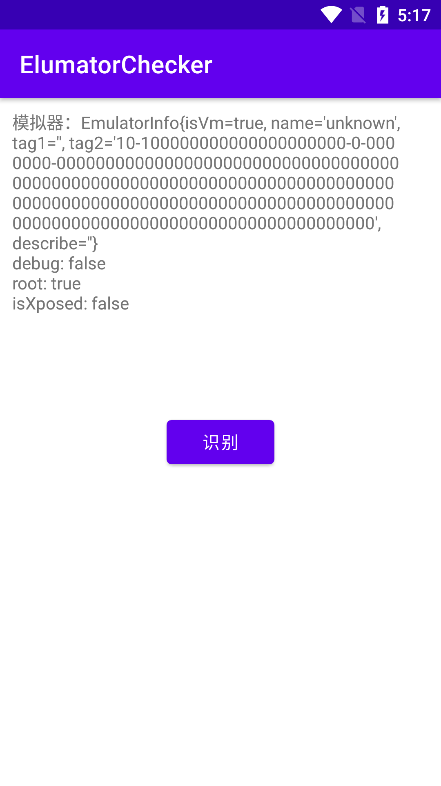

# 模拟器检测
用于检测模拟器的库

## 使用
+ 下载ElulatorChecker的jar包，集成到项目里面去。
+ 使用
```
@Override
    protected void onCreate(Bundle savedInstanceState) {
        super.onCreate(savedInstanceState);
        setContentView(R.layout.activity_main);

        LogUtil.setDebug(false);

        TextView textView = findViewById(R.id.tv_show);

        findViewById(R.id.btn_check).setOnClickListener(v -> {
            EmulatorInfo emulator = DangerProtector.isEmulator(MainActivity.this, 2);  //获取模拟器信息
            boolean debug = DangerProtector.isDebug(MainActivity.this);   //获取debugdebug
            boolean root = DangerProtector.isRoot(MainActivity.this);    //获取是否root
            boolean isXposed = DangerProtector.isXposedExist(MainActivity.this);  //获取是否有xposed

            textView.append("模拟器：" + emulator.toString() + "\n");
            textView.append("debug: " + debug + "\n");
            textView.append("root: " + root + "\n");
            textView.append("isXposed: " + isXposed + "\n");
        });
    }
```

## 截图
